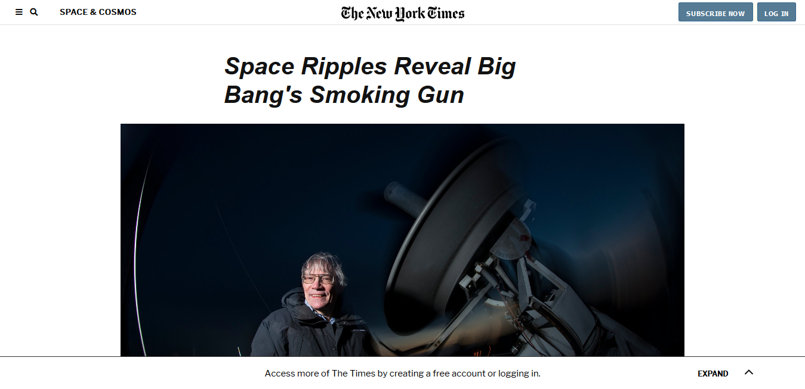

# NEW YORK TIMES CLONE

> We built a clone of [this New York Times article](https://www.nytimes.com/2014/03/18/science/space/detection-of-waves-in-space-buttresses-landmark-theory-of-big-bang.html?_r=0) using pure HTML and CSS. On the CSS side, we did the entire layout using CSS positioning and floats. No Grid or Flexbox was used.

Additional description about the project and its features.

## Built With

- HTML 5,
- CSS 3,

## Live Demo

[Live Demo Link](https://rawcdn.githack.com/RamseyNjire/new-york-times-clone/9b05b27b2b365da4c4c229c90c88b50280289ef5/index.html)

## Authors

👤 **Author1**

- Github: [@RamseyNjire](https://github.com/RamseyNjire)
- Twitter: [@untakenramram](https://twitter.com/untakenramram)
- Linkedin: [Ramsey Njrire](https://www.linkedin.com/in/ramsey-njire-51984931/)

👤 **Author2**

- Github: [@Cyrus-Kiprop](https://github.com/Cyrus-Kiprop)
- Twitter: [@kipropJS](https://twitter.com/kipropJS)
- Linkedin: [Cyrus Kiprop](https://www.linkedin.com/in/cyrus-kiprop-ba7320120/)

## Show your support

Give a ⭐️ if you like this project!

## 📝 License

This project is [MIT](lic.url) licensed.
